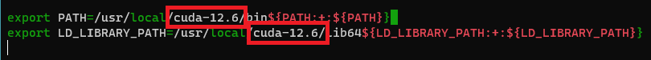
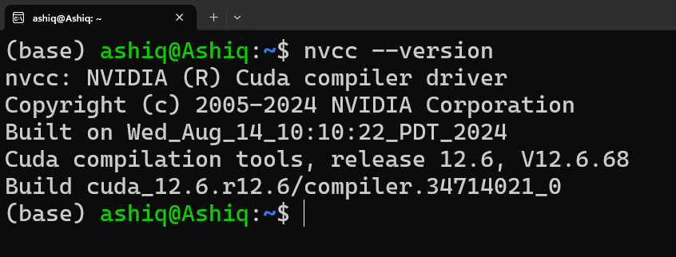
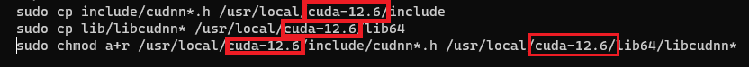
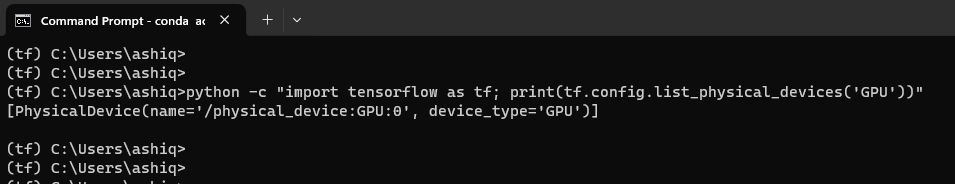

# Install Tensorflow GPU on WSL (Windows Subsystem for Linux)

---
## 1. Install WSL on Windows
### 1.1 Open command prompt or powershell and run the following command:

    wsl --install

### 1.2 After installing run these following commands:
    supo apt update
    sudo apt upgrade
    sudo install build-essentials

### 1.3 Create a link between WSL and Windows user (put your windows username in the command):
    ln -s /mnt/c/Users/[your_windows_username] ~/win-home
    cd win-home

---
## 2. Anaconda
### 2.1 Download Anaconda Linux (64-bit installer) from the following link:
    https://www.anaconda.com/download/success
### 2.1 Go to Download folder:
    cd Downloads
### 2.2 Install Anaconda (change the file name according to your downloaded version)
    bash Anaconda3-2024.06-1-Linux-x86_64.sh
### 2.3 After installing run the following command to disable automatic base activation:
    conda activate base
    conda config --set auto_activate_base false

---
## 3. CUDA Toolkit
### 3.1 Download and Install:
    https://developer.nvidia.com/cuda-downloads
or  

    wget https://developer.download.nvidia.com/compute/cuda/12.6.2/local_installers/cuda_12.6.2_560.35.03_linux.run
    sudo sh cuda_12.6.2_560.35.03_linux.run
### 3.2 Add CUDA path:
#### 3.2.1 Open bashrc in nano:
    nano ~/.bashrc
#### 3.2.2 Add these two lines at the end of the file (change the cuda version, 12.6 in my case):
    export PATH=/usr/local/cuda-12.6/bin${PATH:+:${PATH}} 
    export LD_LIBRARY_PATH=/usr/local/cuda-12.6/lib64${LD_LIBRARY_PATH:+:${LD_LIBRARY_PATH}}

#### 3.2.3 Save and close the file by pressing:
    ctrl + o 
then  

    ctrl + x
#### 3.2.4 source the barshrc file:
    source ~/.bashrc
#### 3.2.5 Open config file:
    sudo nano /etc/ld.so.conf
#### 3.2.6 Add the line at the end:
    /usr/local/cuda-12.6/lib64
#### 3.2.7 Save and close the file by pressing:
    ctrl + o 
then  

    ctrl + x
#### 3.2.8 Run the command to update the cache of shared libraries:
    sudo ldconfig
### 3.3 Check if CUDA installed successfully:
    nvcc --version 

---
## 4. cudNN
### 4.1 Download cudNN from here:
    https://developer.nvidia.com/rdp/cudnn-archive
### 4.2 Unzip (change the file name according to your version) and select the unzipped directory:
    tar -xvf cudnn-linux-x86_64-8.9.7.29_cuda12-archive.tar.xz
    cd cudnn-linux-x86_64-8.9.7.29_cuda12-archive    
### 4.3 Run these commands (change the cuda version, 12.6 in my case):
    sudo cp include/cudnn*.h /usr/local/cuda-12.6/include
    sudo cp lib/libcudnn* /usr/local/cuda-12.6/lib64
    sudo chmod a+r /usr/local/cuda-12.6/include/cudnn*.h /usr/local/cuda-12.6/lib64/libcudnn*

---
## 5. TensorFlow
### 5.1 Create a new conda environment if needed and then aftivate the environment:
    conda create --name tf python=3.9
    conda activate tf
### 5.2 Install TensorFlow:
    python3 -m pip install tensorflow[and-cuda]
### 5.3 Verify:
    python3 -c "import tensorflow as tf; print(tf.config.list_physical_devices('GPU'))"
